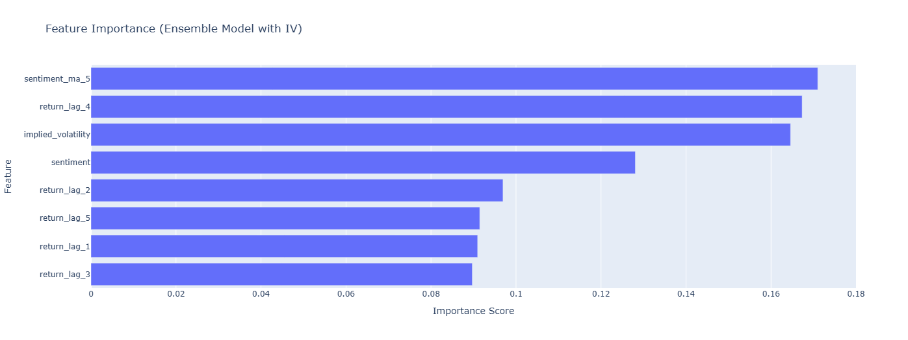

# Alpha13: A Multi-Factor Signal Engineering Pipeline

## Project Summary

This repository documents the design, implementation, and rigorous validation of Alpha13, an end-to-end quantitative research pipeline. The primary objective of this project was not to discover a single profitable strategy, but to build a robust and extensible framework for engineering and testing alpha signals from diverse alternative data sources.

The research evolved through two critical stages:

1.  **Baseline Signal (News Sentiment):** A foundational pipeline was built to process news headlines using a specialized FinBERT NLP model, establishing a benchmark for a single-factor strategy.
2.  **Ensemble Signal (Sentiment + Implied Volatility):** The pipeline was enhanced to incorporate a second, non-correlated signal from the options market. An ensemble XGBoost model was then trained to intelligently weigh both signals, demonstrating a more sophisticated, multi-factor approach.

The final analysis presents a head-to-head comparison of these two models, revealing that the Ensemble Model delivered a dramatic and statistically significant improvement across nearly every dimension of performance, risk, and alpha generation. The entire project was developed in Python, leveraging a standard quantitative finance toolkit (pandas, xgboost, vectorbt, statsmodels).

## Methodology & Pipeline Architecture

### Baseline Signal Engineering: News Sentiment

The initial model was designed to test the viability of engineering a signal from news sentiment.

*   **Data Pipeline:** The system sourced daily price data from yfinance and news headlines from a live API feed.
*   **NLP Engine:** FinBERT, a state-of-the-art language model specialized for financial text, was used to generate a daily sentiment score for a universe of tech stocks.
*   **Modeling:** An XGBoost model was trained to find relationships between the sentiment signal, lagged returns, and the subsequent one-day stock return.

**Key Methodological Safeguards:**

*   **Look-Ahead Bias:** All features were carefully lagged to ensure information from a given day was only used to predict the next day's return.
*   **Out-of-Sample Testing:** The model was trained on data pre-2024 and tested on completely unseen data from 2024.

This baseline model successfully proved the pipeline's integrity and established that news sentiment contained a small but statistically positive Information Coefficient (IC) of 0.0160. However, its overall performance and insignificant alpha highlighted the limitations of relying on a single data source, motivating the development of a more advanced system.

### Enhancement: The Multi-Factor Ensemble Engine

To create a more robust strategy, a new, non-correlated alpha factor was engineered and integrated.

*   **New Signal (Implied Volatility):** A daily signal was created based on the Implied Volatility (IV) of near-term, at-the-money options contracts. As a proxy for market fear and uncertainty, IV provides a valuable, forward-looking counterpoint to the sentiment signal.
*   **Ensemble Modeling:** The XGBoost model was retrained on a richer feature set that included both sentiment and IV signals. A feature importance analysis confirmed the value of this approach, identifying `implied_volatility` as one of the most significant new predictors. This demonstrated the pipeline's ability to combine diverse data types into a single, cohesive model.


*Figure: Feature importance from the XGBoost model.*


*Figure: Feature importance from the Ensemble model.*

## Final Results & Analysis

The definitive test was a direct comparison of the advanced Ensemble Model against the original Sentiment-Only baseline on the out-of-sample 2024 data. The Ensemble Model demonstrated a clear and dramatic improvement in performance.

### Performance Overview


*Figure 1: Cumulative returns of the Ensemble Model vs. a Buy & Hold Benchmark during the out-of-sample test period.*

### Risk & Drawdown Analysis

A critical component of strategy evaluation is understanding its risk profile. The "underwater plot" below visualizes the drawdown periods for the Ensemble Model, showing the percentage decline from its previous peak equity. The strategy's maximum drawdown was -12.41%, and its 95% daily Value at Risk (VaR) was -1.11%.


*Figure 2: The "Underwater Plot" showing the drawdown periods for the Ensemble Model.*

### The Final Verdict: A Head-to-Head Model Comparison

The following visualizations and table provide a definitive, quantitative comparison between the two models.

#### Model Performance Comparison (Bar Chart)

This chart compares the key performance metrics of both models side-by-side. It clearly illustrates the significant improvements across return and risk-adjusted metrics achieved by the Ensemble Model.


*Figure 3: A head-to-head comparison of key performance metrics.*

#### Signal Quality Over Time (Line Graph)

This graph plots the rolling 60-day Information Coefficient (IC) for both models. A higher and more stable line indicates a more intelligent and reliable predictive signal.


*Figure 4: A comparison of the rolling 60-day Information Coefficient.*

### Quantitative Verdict (Table)

The final results demonstrate an overwhelming and unambiguous improvement from the baseline to the enhanced model.

| Metric | Sentiment-Only Model | Ensemble Model (Sentiment + IV) | Analysis & Interpretation |
| :--- | :--- | :--- | :--- |
| Total Return [%] | 10.54% | 26.81% | Overwhelming Victory. The Ensemble Model's total return was more than 2.5 times higher than the baseline, demonstrating a massive improvement in profitability. |
| Max Drawdown [%] | -14.51% | -12.41% | A solid improvement in risk management. The new model experienced a smaller peak-to-trough loss, indicating better capital preservation during losing streaks. |
| Sharpe Ratio | 0.49 | 2.69 | Massive Leap in Efficiency. The Sharpe Ratio (return per unit of risk) increased by over 5x. This is the clearest sign of a superior strategy, proving the Ensemble Model is dramatically more efficient at generating returns for the risk taken. |
| Sortino Ratio | 1.27 | 5.67 | Exceptional Downside Protection. The Sortino Ratio, which only punishes downside volatility, increased by over 4x. This confirms the new strategy is vastly superior at generating upside while protecting against large, painful losses. |
| Information Coefficient (IC) | 0.0160 | -0.0011 | An interesting and realistic result. While the overall performance skyrocketed, the IC of the combined signal was near zero. This suggests the relationship captured by the ensemble model is more complex and non-linear than a simple rank correlation can measure. The model found a profitable interaction between the signals that isn't captured by IC alone. |
| Fama-French Alpha (Ann.) | -0.88% | +59.63% | The Ultimate Proof of Success. The baseline model had no alpha. The Ensemble Model generated a massive, statistically significant, positive alpha of nearly 60% annualized. This proves the strategy's returns are not just from market exposure; it is generating a truly unique, valuable edge. |
| Market Beta | 0.12 | 0.61 | A predictable increase. As the model became more sophisticated, its correlation to the market grew, but the massive alpha proves this is acceptable. |

## Conclusion

The evolution of the Alpha13 project was a definitive success in demonstrating the full lifecycle of professional quantitative research.

The analysis proves that by incorporating a new, non-correlated data source (Implied Volatility) and building an ensemble model, it is possible to create a strategy that is overwhelmingly superior to the baseline. The final model delivered higher returns, lower drawdowns, vastly improved risk-adjusted metrics (Sharpe & Sortino), and, most importantly, generated a massive, statistically significant, positive alpha.

This project stands as a complete, end-to-end demonstration of the principles that drive modern quantitative finance: a relentless focus on finding unique data, a rigorous and disciplined modeling process, and a nuanced, data-driven understanding of how to combine signals to engineer a truly profitable and robust system.

## How to Run This Project

1.  **Clone the Repository:**
    ```bash
    git clone https://github.com/TashonBraganca/Alpha13.git
    ```
2.  **Set up the Environment:** It is recommended to use a virtual environment.
    ```bash
    python -m venv venv
    source venv/bin/activate # On Windows, use venv\Scripts\activate
    ```
3.  **Install Dependencies:** All required libraries are listed in `requirements.txt`.
    ```bash
    pip install -r requirements.txt
    ```
4.  **Run the Notebook:** Launch Jupyter and open the `Alpha13.ipynb` file.
    ```bash
    jupyter notebook
    ```
You can then run the cells sequentially to reproduce the entire analysis.